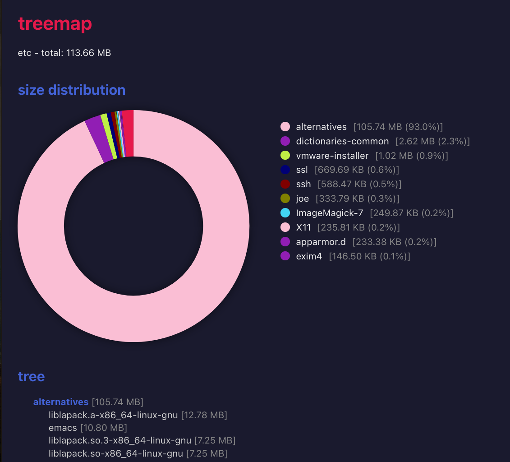

# treemap - directory tree with sizes

treemap recursively lists directory contents as a tree with
human-readable file sizes (B/KB/MB/GB). Optionally generates
an HTML page with an SVG pie chart.

## Dependencies

None.

## Building

Requires zig 0.15+. Adjust the path to your zig binary:

	$ /path/to/zig build

With the bundled binary:

	$ ./zig-x86_64-linux-0.15.2/zig build

The binary is at zig-out/bin/treemap. To install system-wide:

	$ ./zig-x86_64-linux-0.15.2/zig build --prefix /usr/local

For a debug build:

	$ ./zig-x86_64-linux-0.15.2/zig build -Doptimize=Debug

To run tests:

	$ ./zig-x86_64-linux-0.15.2/zig test src/main.zig

## Usage

	treemap [--html] [--help] [path]

Path defaults to the current directory.

With --html, writes treemap.html in the current directory
containing a pie chart and nested tree view.

## License

MIT
